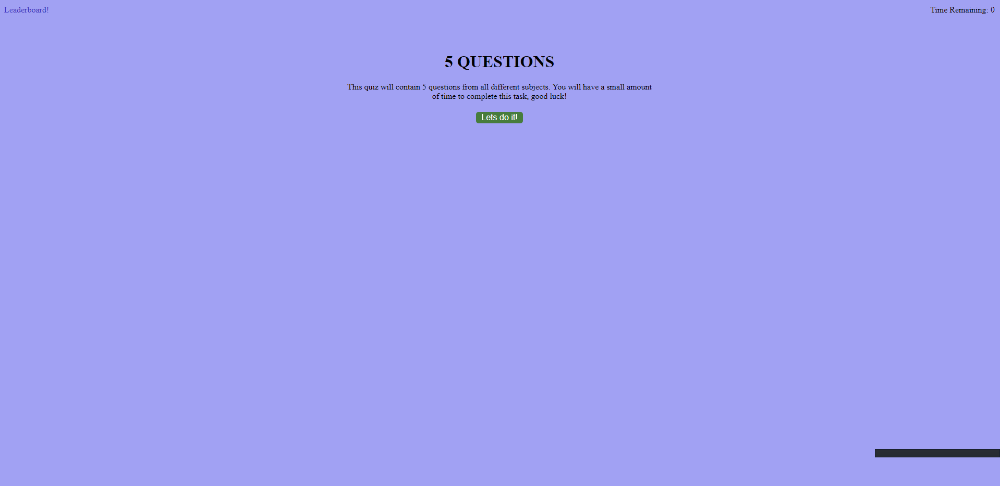
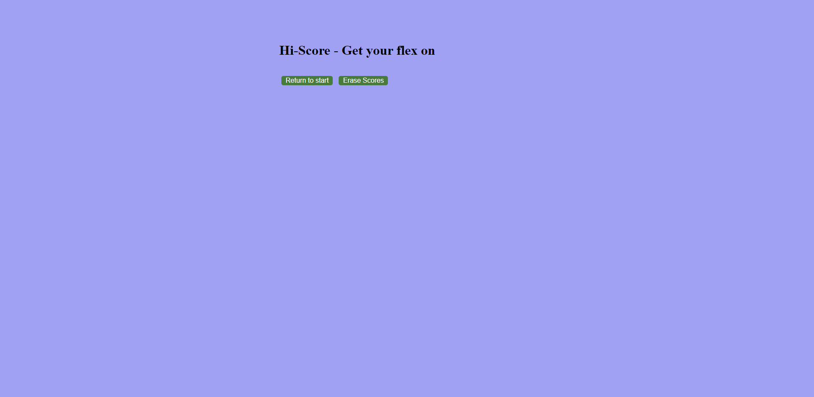

Hello! welcome to my quiz.

This is a quiz that displays 5 questions, and should have a functionality of a timer with a score logging system(i was unable to get the timer to work correctly)

how to: Click on the start button and take the quiz!

through making this i learned about functions and how important understanding css and html is when working with js.